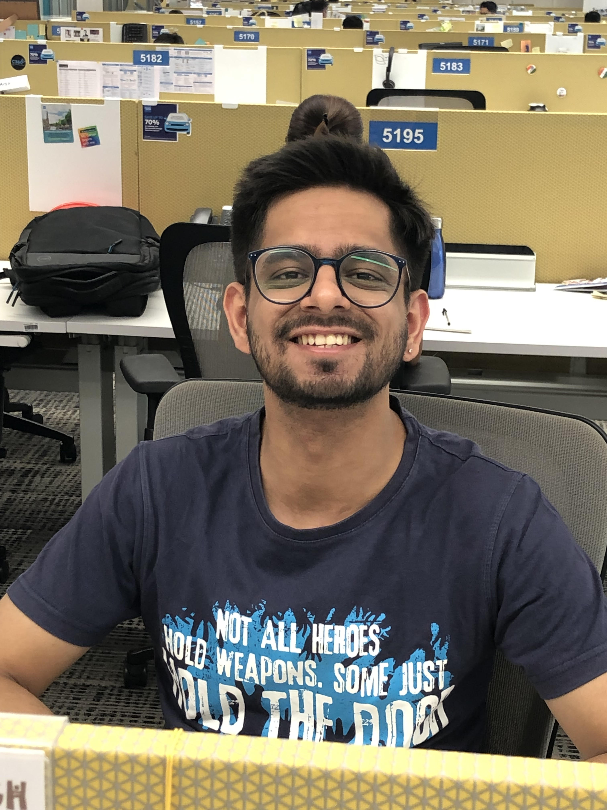

  <!-- picture -->
  

    

      
 <h1>Pulkit Arora</h1> 

      
 <h3>MS CS at UC San Diego</h3> 

      

      
      
      
      

    

    

      

    

  

  <!-- about me -->
  

      

        <h1> About Me </h1> 
        
My name is Pulkit and I'm currently pursuing a Master's in Computer Science and Engineering at UC San Diego. Previously, I was a Software Engineer with Goldman Sachs for roughly a year and nine months. Prior to that, I worked with American Express for two and a half years. I've spent around four years working in the industry with research and development work spanning in Big Data, Machine Learning and highly available web applications. I completed my graduate studies in 2017 from <a href="https://www.pec.ac.in/" target="_blank">Punjab Engineering College, Chandigarh</a> with a major in Computer Science & Engineering.   
        I am interested in the applications of AI & Machine Learning for analysing biological data. I am also interested in the intersection of Machine Learning algorithms and Big Data technologies. Please find a copy of my resume <a href="resources/CV.pdf" target="_blank">here.</a>

      

    

      <!-- education -->
    

        

        <h1> Education </h1>
        

    

  

    

      
<h3>Punjab Engineering College</h3>

      
<h4>B.Tech. in CSE, 9.7/10</h4>

      
<h5>Aug'13 - May'17</h5>

      
<h5>Gold Medal</h5>

    

    

      

I was the recipient of a 100% merit based scholarship for 2 years and graduated first in my class. Below is a description of some of my projects - 

      <!--<h4>Projects</h4>-->
      <ul>
        <li>Co-authored a ​<a href="https://doi.org/10.1109/CCAA.2017.8229773" target="_blank">paper</a> during the final year of college where different ML classification techniques ​were used to achieve the highest accuracy in binary classification of stance data. Was awarded the Silver Medal for the best final year project</li>
        <li>Explored ML & statistical methods in R to analyse fMRI images at Indian Institute of Technology, Delhi during the summer of 2015</li>
        <li>Created a web application where the user draws a weighted graph and the result is a minimum cost spanning tree based on Prim’s algorithm as part of the Algorithms course</li>
        <li>Built a conversational chat application that allowed group chats and file sharing</li>
      </ul>
    

  

  <!--
  
  

    

      
<h4>Relevant Courses</h4>

      

Neural Networks, Artificial Intelligence, Design and Analysis of Algorithms, Data Structures, Theory of Computing, Discrete Mathematics, Database Management Systems, Multimedia Technologies

    

  

  <!-- experience -->
  

    

      <h1> Experience </h1>
    

  

  

    

      
<h3>Goldman Sachs, Bengaluru</h3>

      
<h4>Engineering Associate</h4>

      
<h4>Nov'19 - Aug'21</h4>

    

    

      
I currently work for Goldman Sachs in their Global Markets Division, based out of Bengaluru. In my current role, I've been a part of two automation projects and another project that involved revamping their <a href="http://marketswiki.com/wiki/Synthetic_trades#:~:text=A%20synthetic%20trade%20or%20synthetic,the%20same%20risk%2Dreward%20profile.">Synthetic</a> Client Reporting tech stack.   
      The first automation project involved helping traders across New York, London and Hong Kong automate booking trades on the company's proprietary software. My efforts were concentrated on designing, developing, optimizing and testing the workflow automation. I also devoted a significant part of my time in developing control scenarios in Python to alert in case of workflow failures. My second automation project involved setting up an automated regression environment that helped my team test and release their changes faster. This involved writing shell scripts and orchestrating the workflow.  
      Lately, I've been working on automating batch workflows & scripts to extract reporting data based on synthetic stocks traded by clients on a given day and storing it in MongoDb. This also involved writing a Restful service in Java to expose reporting data extracted in MongoDb.
      
  
    

    

      
<h3>American Express, Gurgaon</h3>

      
<h4>Software Engineer II</h4>

      
<h4>Jul'17 - Nov'19</h4>

    

    

      
Right after college, I worked for American Express. I was the youngest and the newest member in a team of passionate developers that launched the company's Risk Management Platform called <a href="https://deloitte.wsj.com/riskandcompliance/2018/01/29/shaping-strategy-with-data-and-insights-paul-fabara-cro-american-express/" target="_blank"><i>Smart Monitoring</i></a>. I was responsible for training and deploying an ML model to predict and alert if an Amex’s debtor’s credit worthiness might be impacted based on articles being written about them in the news. I also wrote several RESTful microservices in Java using Spring Boot with HBase as the datasource.   
      Apart from this, I also built a CV parsing and ordering system. My team would receive hundreds of CVs for an open position and it would involve a lot of manual effort to go through all of them to identify the right candidates to interview. I used NLP processing techniques (LDA based NER, PoS Tagging, Named Entity Extraction, Topic Modelling etc.) to extract features from CVs and also trained a Naive Bayes based model that predicted how likely a candidate would convert the interview to an offer based on the data of candidates that were previously selected. 
  
    

  

  <!-- publications -->
  

    

      <h1> Publications </h1>
    

  

  

    

        <a href="https://doi.org/10.1109/CCAA.2017.8229773" target="_blank"> Classification of locomotive disorders based on stance parameters</a>  Pulkit Arora, Archit Singla, Saruchi Aggarwal, Divija Rawat, Dr. Padmavati Khandnor, Neelesh Kumar, Kashif I Sherwani  <a href="https://ieeexplore.ieee.org/xpl/conhome/8168800/proceeding" target="_blank"> International Conference on Computing, Communication and Automation (ICCCA)</a>, 2017
    

  

  <!-- teaching -->
  

    

      <h1> Teaching </h1>
    

  

  

    

      
<h3>Junior Einstein, Chandigarh</h3>

      
<h4>Teaching Volunteer</h4>

      
<h5>Aug'13 - May'17</h5>

    

    

      

During my undergraduate studies, I volunteered with an NGO called Junior Einstein, which focused on teaching underprivileged students in rural India, who are without access to quality education.  I took the responsibility to teach math and science to students in grade 9 and 10, helping them to secure admissions in engineering colleges in India. I would design the course material, which included concepts that the students are evaluated frequently on in the engineering entrance exams. I worked along with fellow volunteers and then would conduct one-hour lectures at a nearby government school twice a week. This reflected in the efforts I put in during the first 3 years of my association with Junior Einstein, which were recognized by its founders and I was subsequently asked to serve as the Joint Secretary of the same during my final year.
      

    

  

